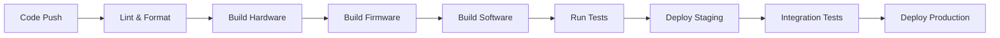

# Automation - REZONATE

## Overview
GitHub Actions, CI/CD bootstrap, and automation workflows for the REZONATE project.

## Automation Components

### 🚀 GitHub Actions (`/.github/workflows/`)
- **rezonate-build.yml**: Build and test all REZONATE components
- **rezonate-deploy.yml**: Deploy firmware and UI applications
- **auto-format.yml**: Code formatting and linting
- **doc-generation.yml**: Auto-update documentation
- **dependency-update.yml**: Automated dependency management

### 🔄 CI/CD Pipeline


### 🔧 Development Automation
- **Pre-commit Hooks**: Automated formatting and basic validation
- **Dependency Scanning**: Security vulnerability detection
- **Performance Monitoring**: Automated benchmarking
- **Documentation Sync**: Keep docs updated with code changes

## GitHub Actions Workflows

### Build & Test (`rezonate-build.yml`)
```yaml
# Triggered on: push to main, pull requests
# Tests: hardware schematics, firmware compilation, software tests
# Platforms: Ubuntu, macOS, Windows
# Artifacts: build outputs, test reports
```

### Deployment (`rezonate-deploy.yml`)
```yaml
# Triggered on: release tags, manual dispatch
# Deploys: firmware binaries, mobile apps, web interfaces
# Environments: staging, production
# Notifications: Discord, email alerts
```

### Auto-formatting (`auto-format.yml`)
```yaml
# Triggered on: every push
# Actions: code formatting, lint fixes, style checks
# Languages: C++, Python, JavaScript, TypeScript
# Auto-commit: formatted code back to branch
```

## Local Development Automation

### Setup Scripts
```bash
# Initial project setup
./automation/setup/install-dependencies.sh

# Development environment
./automation/setup/configure-dev-env.sh

# Hardware simulation setup
./automation/setup/setup-simulation.sh
```

### Build Automation
```bash
# Build all components
./automation/build/build-all.sh

# Build specific component
./automation/build/build-firmware.sh
./automation/build/build-software.sh
./automation/build/build-docs.sh
```

### Testing Automation
```bash
# Run all tests
./automation/test/run-all-tests.sh

# Hardware-in-loop testing
./automation/test/hil-test.sh

# Performance benchmarks
./automation/test/benchmark.sh
```

## Configuration Files

### Pre-commit Configuration (`.pre-commit-config.yaml`)
```yaml
repos:
  - repo: https://github.com/psf/black
    rev: 23.3.0
    hooks:
      - id: black
        language_version: python3
  
  - repo: https://github.com/pre-commit/mirrors-clang-format
    rev: v16.0.6
    hooks:
      - id: clang-format
        files: \.(c|cc|cxx|cpp|h|hpp|hxx)$
  
  - repo: https://github.com/pre-commit/mirrors-prettier
    rev: v3.0.0
    hooks:
      - id: prettier
        files: \.(js|ts|jsx|tsx|json|css|md)$
```

### Dependabot Configuration (`.github/dependabot.yml`)
```yaml
version: 2
updates:
  - package-ecosystem: "pip"
    directory: "/firmware"
    schedule:
      interval: "weekly"
  
  - package-ecosystem: "npm"
    directory: "/software/performance-ui"
    schedule:
      interval: "weekly"
  
  - package-ecosystem: "github-actions"
    directory: "/"
    schedule:
      interval: "monthly"
```

## Automation Scripts

### Self-Healing Mechanisms
```bash
# Fix broken YAML files
./automation/self-heal/fix-yaml.sh

# Repair folder references
./automation/self-heal/fix-references.sh

# Restore missing dependencies
./automation/self-heal/restore-deps.sh
```

### Deployment Automation
```bash
# Firmware deployment
./automation/deploy/deploy-firmware.sh

# Mobile app deployment
./automation/deploy/deploy-mobile.sh

# Web interface deployment
./automation/deploy/deploy-web.sh
```

### Monitoring & Alerts
```bash
# Health check all services
./automation/monitor/health-check.sh

# Performance monitoring
./automation/monitor/performance-check.sh

# Send alerts on failures
./automation/monitor/alert-system.sh
```

## Integration with External Services

### Cloud Services
- **AWS S3**: Firmware binary storage
- **CloudFlare**: Web interface CDN
- **Sentry**: Error tracking and monitoring
- **DataDog**: Performance monitoring

### Communication
- **Discord Webhooks**: Build status notifications
- **Slack Integration**: Team collaboration alerts
- **Email Notifications**: Critical system alerts
- **SMS Alerts**: Emergency notifications

### Development Tools
- **SonarCloud**: Code quality analysis
- **CodeCov**: Test coverage reporting
- **Snyk**: Security vulnerability scanning
- **Renovate**: Automated dependency updates

## Local-to-Remote Sync

### Git Hooks
```bash
# Pre-push validation
./automation/hooks/pre-push-validate.sh

# Post-commit actions
./automation/hooks/post-commit-sync.sh

# Branch synchronization
./automation/hooks/sync-branches.sh
```

### Development Sync
```bash
# Sync local changes to staging
./automation/sync/sync-to-staging.sh

# Sync configuration updates
./automation/sync/sync-config.sh

# Sync documentation changes
./automation/sync/sync-docs.sh
```

## Performance Optimization

### Build Optimization
- **Parallel Builds**: Multi-core compilation for firmware
- **Incremental Builds**: Only rebuild changed components
- **Caching**: Dependency and build artifact caching
- **Compression**: Optimized binary sizes

### Testing Optimization
- **Parallel Testing**: Run tests concurrently
- **Smart Testing**: Only test affected components
- **Test Caching**: Cache test results for faster runs
- **Early Termination**: Stop on first failure (dev mode)

## Troubleshooting Automation

### Common Issues
```bash
# Fix CI/CD pipeline failures
./automation/troubleshoot/fix-pipeline.sh

# Resolve dependency conflicts
./automation/troubleshoot/resolve-deps.sh

# Clean corrupted build artifacts
./automation/troubleshoot/clean-builds.sh
```

### Debug Mode
```bash
# Enable verbose logging
export REZONATE_DEBUG=true

# Run automation with debug output
./automation/debug/debug-build.sh
```

## Contributing to Automation

### Adding New Workflows
1. Create workflow file in `.github/workflows/`
2. Test locally with `act` (GitHub Actions simulator)
3. Document workflow in this README
4. Add corresponding local scripts

### Automation Standards
- Use consistent naming conventions
- Include error handling and rollback mechanisms
- Add logging for debugging
- Document all configuration options
- Test automation scripts thoroughly

---
*REZONATE Automation - Streamlined Development & Deployment*

**Integration Points:**
- Hydi AI: Voice-controlled deployment commands
- Frank Bot: Automated system monitoring
- ProtoForge: Enterprise workflow integration